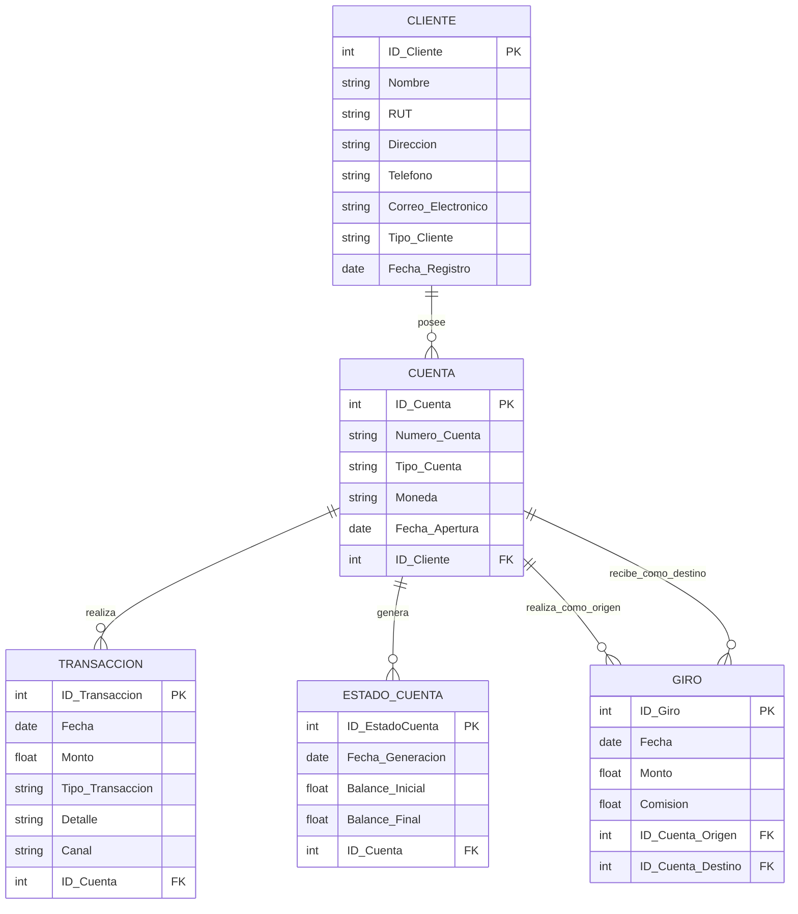

| Comando SQL                                             | Descripción                                                      |
|---------------------------------------------------------|------------------------------------------------------------------|
| `SELECT version();`                                     | Obtener la versión de PostgreSQL                                 |
| `SELECT datname FROM pg_database;`                      | Obtener la lista de bases de datos                               |
| `SELECT table_name FROM information_schema.tables WHERE table_schema='public';` | Obtener la lista de tablas en el esquema `public`                |
| `SELECT pg_size_pretty(pg_database_size('nombre_base_datos'));` | Ver el tamaño de una base de datos                               |
| `SELECT current_user;`                                  | Obtener el nombre del usuario actual                             |
| `SELECT column_name, data_type FROM information_schema.columns WHERE table_name = 'nombre_tabla';` | Ver las columnas de una tabla                                    |
| `SELECT * FROM pg_stat_activity;`                       | Consultar las conexiones activas                                 |
| `SELECT current_schema();`                              | Ver el esquema actual                                            |

# Caso de Estudio: Gestión de Cuentas en el Banco Estado de Chile

## Contexto

El Banco Estado de Chile, una de las instituciones financieras más grandes y tradicionales del país, ha decidido modernizar su sistema de gestión de cuentas bancarias para mejorar la eficiencia y seguridad de sus operaciones. Este nuevo sistema debe ser capaz de manejar información sobre clientes, sus cuentas, y todas las transacciones relacionadas, como depósitos, retiros, transferencias (giros), y pagos de servicios. Además, debe ser capaz de generar informes de estado de cuenta periódicos para sus clientes, tanto en formato físico como digital.

## Descripción del Problema

Como parte del equipo encargado de desarrollar el nuevo sistema, se te ha solicitado diseñar la base de datos que soportará esta plataforma. El sistema debe ser capaz de almacenar información clave de cada cliente, las cuentas que tienen en el banco, y todas las transacciones que realicen. Además, el Banco Estado desea que cada cliente reciba un estado de cuenta mensual, que incluya el balance inicial, las transacciones realizadas, y el balance final. Esto permitirá a los clientes tener un control más efectivo de sus finanzas.

El sistema también debe poder manejar transferencias, conocidas como giros, que son transacciones especiales donde se envía dinero desde una cuenta a otra, ya sea dentro del mismo banco o hacia cuentas en otros bancos, a través de la red de transferencias nacionales (Ej: RedBanc o la plataforma de transferencias electrónicas del Banco Central).

## Requisitos Específicos

| Elemento       | Descripción                                                                                                                                               |
|----------------|-----------------------------------------------------------------------------------------------------------------------------------------------------------|
| **Clientes**   | - Almacenar información detallada de cada cliente, incluyendo:                                                                                           |
|                |   - Nombre                                                                                                                                               |
|                |   - RUT (Rol Único Tributario)                                                                                                                           |
|                |   - Dirección                                                                                                                                           |
|                |   - Número de teléfono                                                                                                                                   |
|                |   - Correo electrónico                                                                                                                                   |
|                | - Cada cliente tiene un identificador único en el sistema.                                                                                               |
|                | - Almacenar información adicional como el tipo de cliente (persona natural o jurídica) y la fecha en que se unió al banco.                               |
| **Cuentas**    | - Un cliente puede tener múltiples cuentas en el Banco Estado, que pueden ser de tipo corriente, ahorro, o cuentas vista (como la CuentaRUT).            |
|                | - Cada cuenta tiene un número único y se registra la fecha en que fue abierta.                                                                           |
|                | - Las cuentas tienen un tipo de moneda asociado, generalmente pesos chilenos (CLP) o dólares estadounidenses (USD).                                      |
| **Transacciones** | - Registrar todas las transacciones realizadas en las cuentas, incluyendo:                                                                            |
|                |   - Depósitos                                                                                                                                           |
|                |   - Retiros                                                                                                                                             |
|                |   - Giros (transferencias)                                                                                                                              |
|                |   - Pagos de servicios                                                                                                                                  |
|                | - Cada transacción debe incluir:                                                                                                                        |
|                |   - Fecha                                                                                                                                               |
|                |   - Monto                                                                                                                                               |
|                |   - Tipo de transacción                                                                                                                                 |
|                |   - Detalle sobre la operación (Ej: "Depósito en efectivo", "Pago de cuenta de luz").                                                                    |
|                | - Indicar si la transacción se realizó a través de un cajero automático, ventanilla, o medios electrónicos (web o app).                                  |
| **Estado de Cuenta** | - Generar un estado de cuenta mensual para cada cuenta, que muestre:                                                                                 |
|                |   - Balance inicial                                                                                                                                     |
|                |   - Balance final                                                                                                                                       |
|                |   - Resumen de las transacciones realizadas en ese período.                                                                                             |
|                | - Permitir que los clientes descarguen este informe a través de su portal web, o lo reciban en su correo electrónico.                                    |
|                | - Incluir información sobre cualquier comisión o interés generado durante el período.                                                                    |
| **Giros (Transferencias)** | - Gestionar transferencias de dinero desde una cuenta de origen hacia otra cuenta de destino.                                                        |
|                | - Registrar tanto la cuenta de origen como la cuenta de destino.                                                                                         |
|                | - Gestionar comisiones asociadas a la transferencia si es hacia otro banco.                                                                              |

## Tareas

1. **Identificación de Entidades y Relaciones:**
   - Identifica las principales entidades que se deben modelar en la base de datos y define las relaciones entre ellas.
   - Considera cómo se relacionan los clientes con sus cuentas, las cuentas con las transacciones, y las transacciones con los giros.

2. **Modelo Entidad-Relación (ER):**
   - Diseña un diagrama entidad-relación que incluya las entidades identificadas, sus atributos, y las relaciones entre ellas. Asegúrate de identificar las claves primarias y foráneas.

3. **Normalización:**
   - Normaliza las tablas resultantes para garantizar que la base de datos no contenga redundancias y esté estructurada de manera eficiente.

4. **Consultas Requeridas:**
   - Escribe las consultas necesarias para generar un estado de cuenta para un cliente, mostrando el balance inicial, las transacciones realizadas en un mes específico, y el balance final.

5. **Manejo de Giros (Transferencias):**
   - Diseña cómo se gestionarán los giros entre cuentas. Considera las implicaciones si el giro es hacia una cuenta dentro del mismo banco o hacia otro banco. Describe cómo se registran las comisiones y cómo se actualiza el saldo de las cuentas involucradas.

Aquí tienes el diagrama entidad-relación en formato Mermaid:

